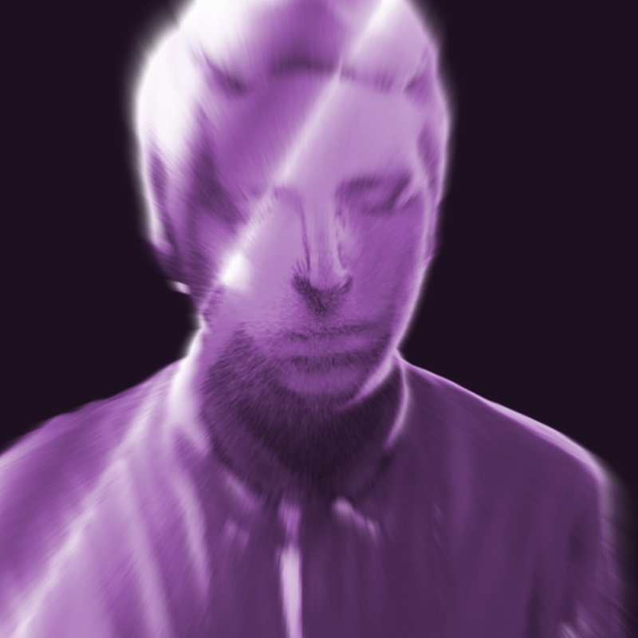

You've stumbled upon the web presence of recent _Digital Art & Technology_ graduate __Florian Brueckner__.

Florian is a young _Interaction Designer_ from the heart of Europe and a firm believer in world betterment by the means of quality digital entertainment and tangible experiences. His work touches many disciplines: from _New Media Art_, over _User Interface Design_ to _Game Development_.

On a related note, he is also a proud member of [Appsterdam][1] and founder of the [hanebouken game collective][2]. In his former life, he's probably been a penguin.

[1]: http://appsterdam.rs
[2]: http://hanebouken.com
