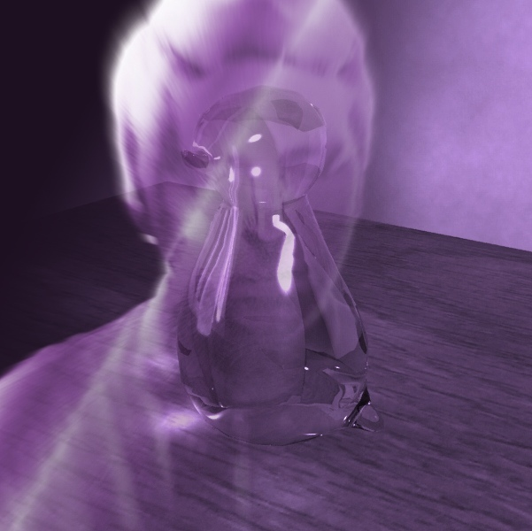

_Herzlich willkommen_, _bienvenue_, _välkommen_, _welcome_!

You've stumbled upon the tenth iteration of my web presence, me being recent _Digital Art & Technology_ graduate __Florian Brueckner__.

I'm a young _Interaction Designer_ from the heart of Europe and a firm believer in world betterment by the means of quality digital entertainment and tangible experiences. My work touches many disciplines: from _New Media Art_, over _User Interface Design_ to _Game Development_.

On a related note, I am also a proud member of [Appsterdam][1] and founder of the [hanebouken game collective][2]. In my former life, I've probably been a penguin.

Picture of my likeness to follow

This website was built upon Johan Nordberg's static site generator [Wintersmith][3], the source is available on my [GitHub profile][4] (Spoiler warning! - Work in progress..).

[1]: http://appsterdam.rs
[2]: http://hanebouken.com
[3]: http://www.wintersmith.io
[4]: http://github.com/bloomingbridges/portflolio
