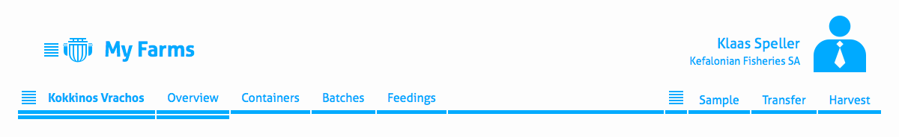
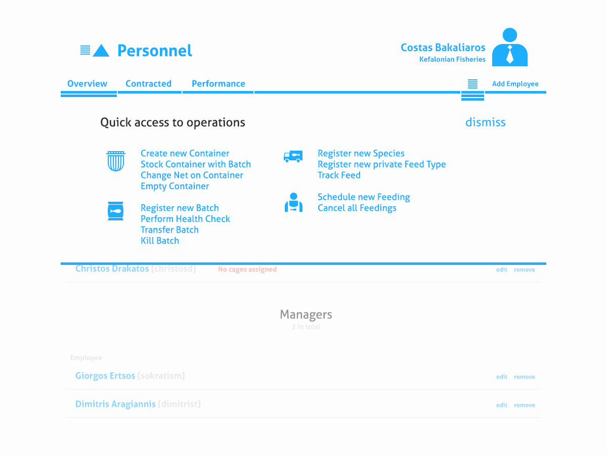

For three months nearing the end of 2013 I was invited to move to Athens (Greece) to work on a revolutionary product tackling the problems facing the aquaculture industry today: the [Aquanetix](http://www.aquanetix.co.uk) platform.

__Aquanetix__ is a cloud-based solution for monitoring productivity and stock on fish farms. It comprises of the web-based _Admin_ interface and the complimentary native Android client used for data entry or receiving critical updates in real-time. The two clients needed to be designed with different user groups in mind: 

- __The mobile app__ would be used in broad daylight, probably on a boat, in a place much sunnier than wherever you are, i.e. dark, high contrast and not demanding interactions more complex than touch input (you might be wearing a protector that straps the device to your arm). In addition, your staff will most likely not speak the local language, so scrap all text buttons and use descriptive icons instead.

- __The admin interface__ is what you deal with sitting at your office computer, entering tabular data and reading through reports and forecasts generated by the system. The visual design for the _Admin_ allows for that with its subdued white interface. Manipulating data was designed to make you feel like you're in control as well as acting on the objects in question (unlike populating a spreadsheet or filling out a web form).

## The Admin Interface

The application backend hosts a beast of information that want to be displayed and manipulated. In order for the user not to get lost, I put a three-layer-deep hierarchical navigation in place. Instead of having a menu entry for each type of data (e.g. employee, feed types, pond), all views are presented in a context-sensitive way. This enforces that where you want to go or what you want to achieve is always just one (or two at most) clicks away and the navigation serves as a mere orientation aid.

Three layers of navigation - List icons designate a menu dropdown

Not only has this job been my first project post-graduation, it's also been my first time mentoring another person. I guided the young illustrator and aspiring UI Designer [Nikos Skoulikas](gr.linkedin.com/pub/nikolaos-skoulikas/73/a69/823) through his first job designing for mobile and got him to the develop the iconography for both products under my supervision.

Access every possible operation and wizard through a shortcut popover

A round-up of my custom form elements - fully accessible and mobile-friendly

I wish the venture all the funding and success in the world. So long and thanks for all the fish.
