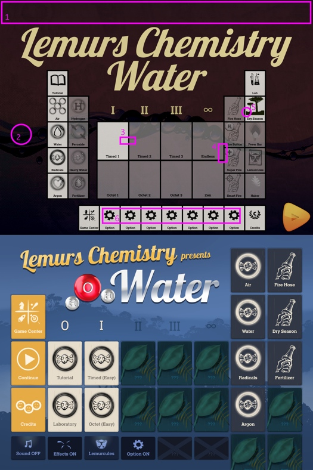
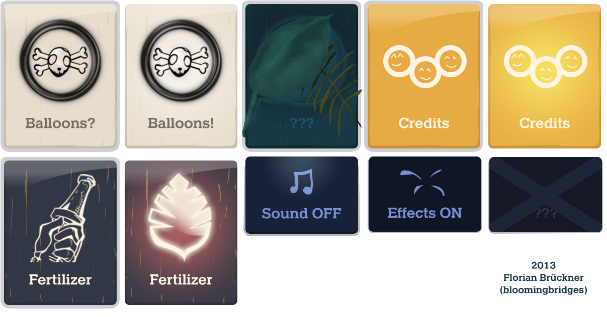
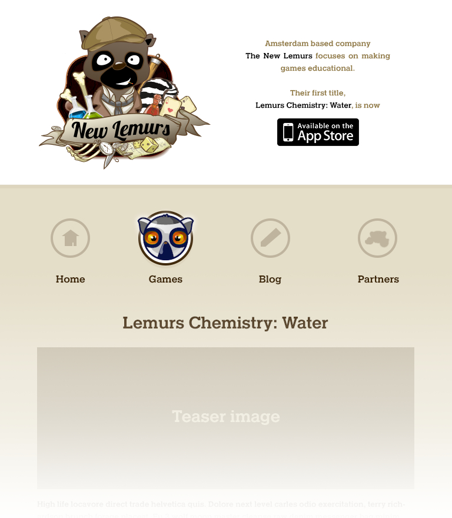

Over the course of a weekend in early 2013 I was called in remotely to wrap up the user interface for the [New Lemurs](http://newlemurs.com/chemistry/en)'s first iOS game __Lemurs Chemisty: Water__, the first installment of a new breed of educational games produced in [Appsterdam](http://appsterdam.rs). _Water_ was designed for multitouch and the big _iPad_ screen in mind. True to the saying "learning by doing", kids have to combine molecules (read: lemurcules) on-screen by the force of their fingers to make water for the plants.

Apart from making sure the assets were all ready for submission on the Monday after, I produced a new design for the game's main menu from scratch. It was the lemurs' intention that the main entry point to the game should resemble a periodic table of the elements. 

Before - After

All the items needed to be layed out sensibly for the idea to work. The obscure background was replaced with in-game assets to retain are more uniform style throughout the experience. 

If there had been more time on our hands I would have liked to incorporate hidden sections to slide out and more stuff to explore as you progress.

Menu button designs

Website mockup
