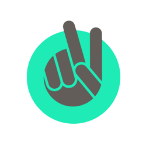

Designing interfaces under pressure seems to have become my trademark over the years. Last October I had the pleasure of helping out [two enthusiastic Dutchmen](http://www.cityshare.com), realising their vision for travel tip sharing on iOS (7) -  _CityShare_. 

Over the course of a week in November they were invited to build their MVP in sunny Athens, where I happened to follow my day job for _Aquanetix_ at the time. This happened as part of an initiative by the not-co-working space _Stone Soup_, which catered to their every needs with additional fingers, food and accommodation. Read all about it on their [blog](http://stonesoup.io/2013/11/The-Greek-Pressure-Cooker.html).

Make sure to check out their [crowdfunding campaign](http://www.symbid.nl/ideas/4506-cityshare) if this post caught your interest.

