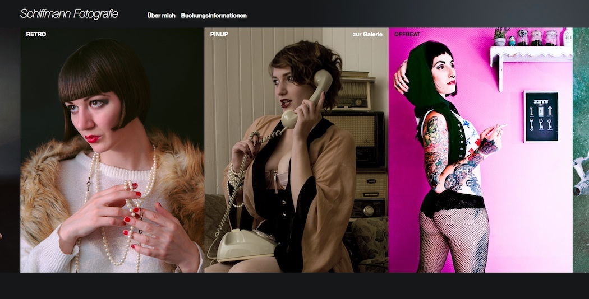

_Oh look, here's a portfolio website on a portfolio website.._

My German photographer friend Cornelius is starting out with his business __Schiffmann Fotografie__ and was in need for a modern website that would do his obscure body of work justice.

Since there isn't always an obvious category for a _Schiffmann_ shoot to fall under, we ended up with a lot of them and used this as a concept for the landing page. All galleries have teaser images that open up like a fan when scrolling horizontally across the page.

The site was built using a custom Node.js stack (_Express_), allowing the maestro himself to manage his galleries by uploading images and metadata files onto an FTP server.

Going live soon(-ish) at [www.schiffmannfotografie.de](http://www.schiffmannfotografie.de).
