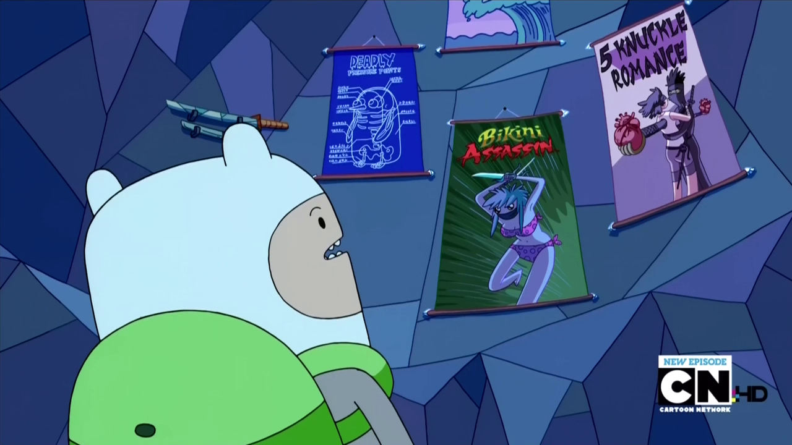
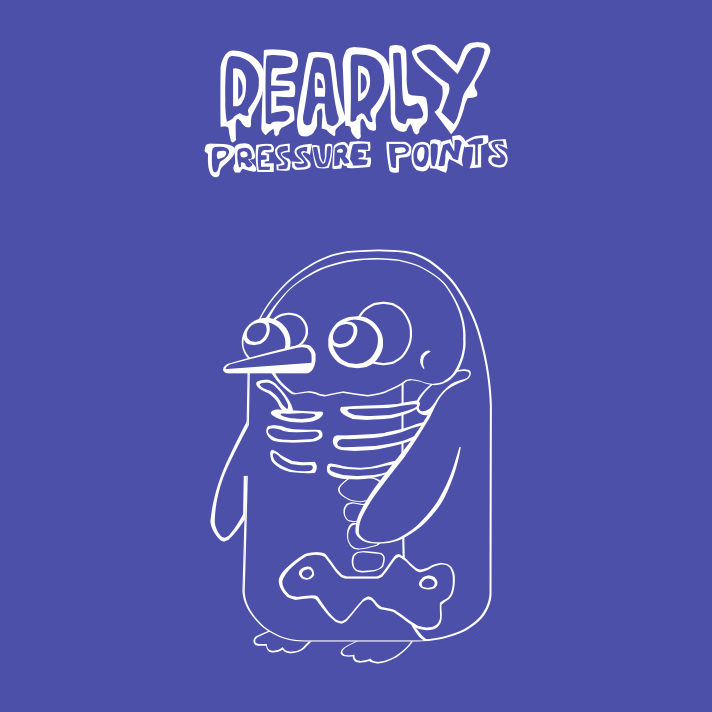

As a fanatic penguin fan and avid _Adventure Time_ watcher, I couldn't help but notice this little gem in one of their episodes (the one to the left, of course): 

Still from the <strong>Adventure Time</strong> episode "<strong>Chamber of Frozen Secrets</strong>" &copy; Cartoon Network

If only visible for a few frames in total, I couldn't help but whip out my _wacom_ tablet and try and reproduce the _Deadly Pressure Points_ poster in a higher resolution. The bad news is, that this is still a work-in-progress as I'm having trouble identifying most of the _hiragana_ labels. A little help from a hobby zoologist would be much appreciated :>

I'm also missing a few bones here and there still. Lately I've been using the file to evaluate the [open-source](https://github.com/sprang/Inkpad) vector editing app [Inkpad](https://itunes.apple.com/app/id400083414) on the iPad. Hopefully I will come back to this project soon as I still have some empty walls to fill..

Most recent version
