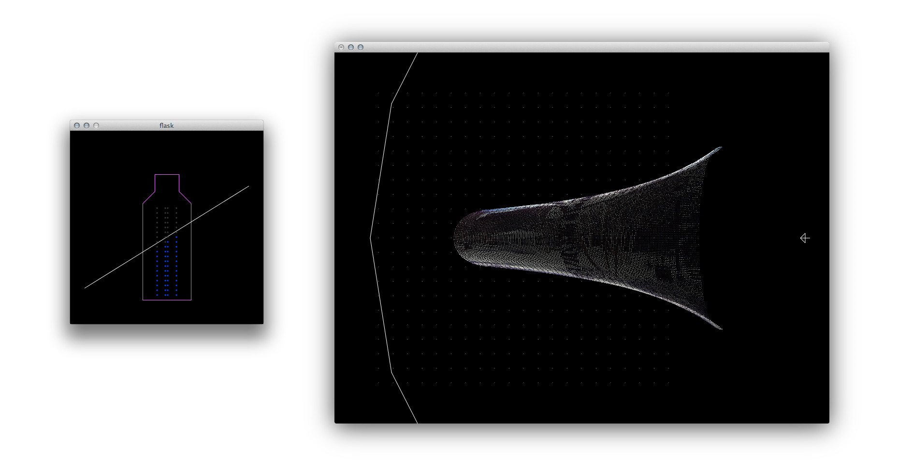
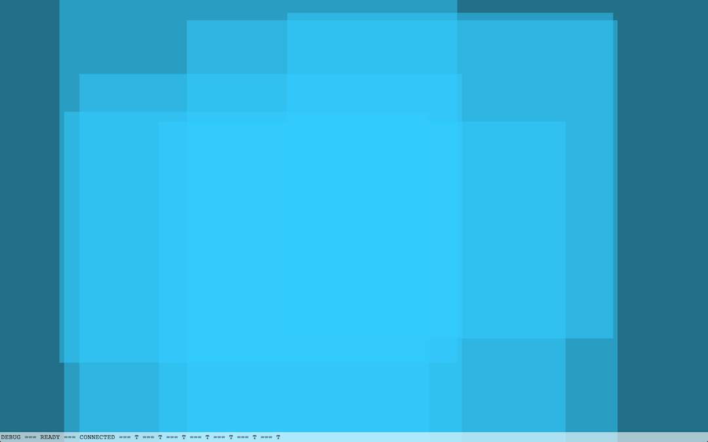

When thinking back about my time at [Plymouth University](http://plymouth.ac.uk), the one project that stands out as the most fulfilling, the most genuinely practical and most critically acclaimed is not the one I put the most lines of code or tears in, but the final group effort of [Saul Hardman](http://saulhardman.com), [James King](http://lostwith.me), [Ben Ashman](http://benashman.me) and myself for the __DAT302 Everyware__ module: __Flask__.

Quoting directly from the [project blog](http://sorakasumi.github.io/flask/):

> __Flask__ is a bottle that collects data. It condenses streams of 1s and 0s and represents the quantity stored using light. It plays on the inherent affordances of its form to map real world actions to digital functions – its cork can be removed and replaced to start and stop the collection of data and its contents can be poured, at varying rates, onto a surface.

And here is the [video demonstration](http://vimeo.com/66462979):
<iframe src="//player.vimeo.com/video/66462979" width="100%" height="281" frameborder="0" webkitallowfullscreen mozallowfullscreen allowfullscreen></iframe>

Our prototype would pull in tweets and photographs (_instagram_s) from the surrounding area. Making the bottle aware of its location would make it a great way of experiencing discussions at conferences we thought, but ultimately you'd be able to manage what gets sucked into __Flask__, so you could as well just consume your daily stream of news at the breakfast table in a novel way.

## The Journey

The hardest part was probably finding a bottle we could use and potentially _customise_. As it turns out, you can't just cut off the bottom of a bottle and glue it back together.. let's call it a learning experience.

Playing with water: Controlling LED strands based on accelerometer data (left, <strong>Processing</strong>) and prototyping liquid data pouring behaviour using a vertex shader (right, <strong>openFrameworks</strong>)

And a learning experience it was. For my part - the visualisation - I decided to pick up enough C++ over the course of a week to be able to deploy the fluid dynamics library [MSAFluid](http://www.memo.tv/ofxmsafluid/) on my _iPad mini_. 

It didn't quite work out, so after a lengthy discussion I rewrote the whole thing in _HTML_ and _JavaScript_. The argument being that the whole backend was written in JS anyway, even the communication between the message broker and the _Arduino Uno_ inside the bottle.

Early HTML 5 Canvas prototype

## Exhibition and Shortcomings

We were asked to put __Flask__ into the __Degree show 2013__ exhibit, in particular to hook it up to a _Microsoft Surface_ table so the action would be better visible to spectators. Once we were set up, the latest version of _Internet Explorer_ installed on the haptic piece of furniture, we encountered  technical problems: 

We already suspected that the battery wouldn't last very long, but the real problem we were facing was wifi connectivity. Too many available hotspots in the gallery space seemed to have distracted our precious bottle. For a commercial product, one would probably opt for a bluetooth shield anyway, to ensure that devices could be paired and only your content displayed.

## The End of an Era

In many ways do I consider __Flask__ to be the pinnacle of my academic career: We rushed head first into the unknown, disregarding the brief for the most part, only lead by our intuition and longing to create. This had been the last opportunity to prove to ourselves that we could build anything we wanted. Our goal? We simply wanted to make something that would be _worthy to appear on [creativeapplications](http://creativeapplications.net)_. 

Four guys coding together in a tiny living room, consuming liter upon liter of black tea (and squash for James), equipped with laptops and their individual talents, not really knowing what exactly it was they were building. In a way, __Flask__ not only captures the spirit of what university life should have been like all along, it stands as the manifestation of our friendship. In a bottle. 2013. What a year.