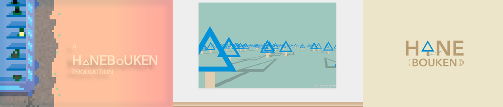
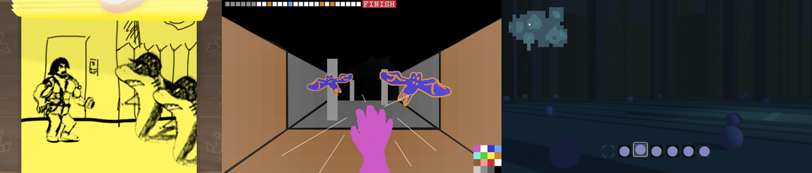
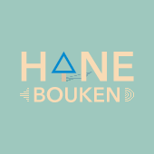

Deep inside every young adult who's been exposed to a fair share of interactive entertainment at an early stage in his or her life, there lies this burning desire to create their own videogames. I've certainly been there and not too long ago I made a decision to feed that desire and start working towards making that dream a reality.

The name for my creative outlet would be __hanebouken__, a portmanteau of the German word "hanebüchen" (colloquial for _fairly hard to believe / questionable_, literally a [type of tree](http://en.wikipedia.org/wiki/Carpinus_betulus)) and _hadouken_, which stands symbolic for a youth wasted trying to beat my friends at _Street Fighter II_.

Design Process - Iterations of the <strong>hanebouken</strong> identity

The deal was such, that I would seek out talented people to collaborate with on small projects, little programming challenges in a beautiful wrapper for the sake of learning and exploration. 
So far, this endevaour has been met with little success, but I am confident that I will find the right partner soon enough.

Graveyard of abandoned prototypes (from left to right): 
<strong>Paul Watson in Attack of the Nazi Sharks</strong>, <strong>Benni's Arm</strong> and <strong>Trollwald</strong>

So I guess I will continue to check out every new game engine, technology and game that the internet throws at me, continue waiting for the _one_, continue coding up prototypes and writing whingey blog post on [hanebouken.com](http://www.hanebouken.com) about my misfortunes, whilst gradually building up an expertise, that will allow me to - one day - make the unbelievable, achievable.

