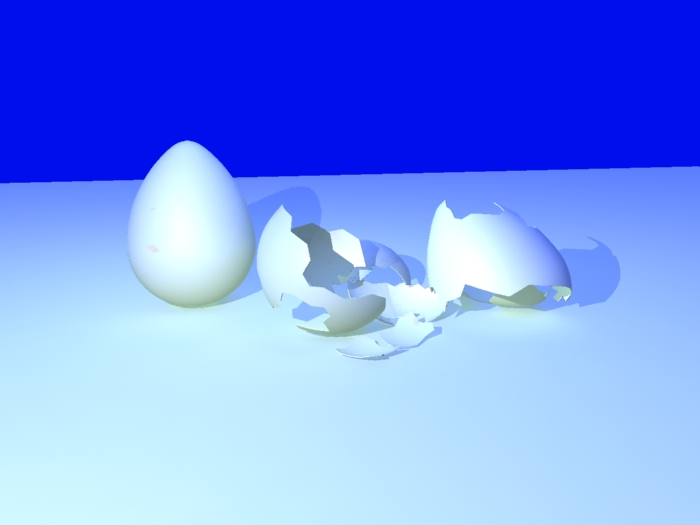
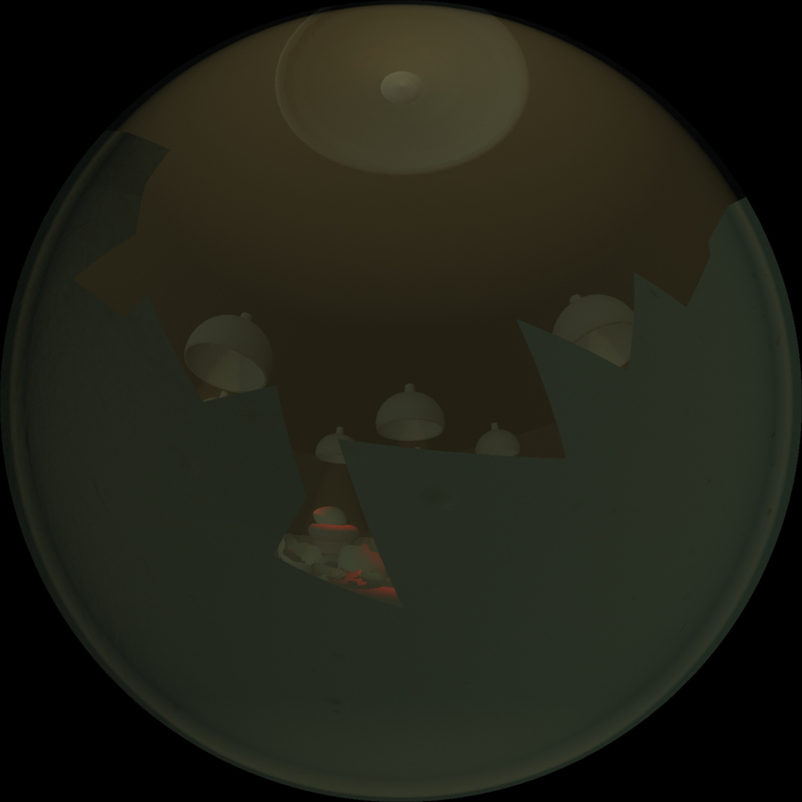

One of the more spectacular assignments in my second year at university was to produce a few minutes' worth of dome-corrected animation for the IVT (Immersive Vision Theatre), the ex-planetarium-now-showroom on the _Plymouth University_ campus.

Figuring out how to animate a bursting egg..

The general idea was to transform the spherical theatre into a womb, where the audience would break out of, only to find themselves imprisoned once more. I tried to evoke a feeling of claustrophobia and nausea in the viewer by taking extra care of lighting and making sure the tumbling down a pipe sequence wasn't too disorienting.

<!--  -->

However grand this opportunity, the memory of this project still leaves a sore taste in my mouth. At the time, our lecturers were giving us an introduction  in the open-source package _blender_, which I refused to pay attention to. Reasoning being, that software packages, which were actually being used in the industry like _Maya_, were freely available to students and thus more worth my time. Plus, throughout the year we had access to a fairly decent database of learning videos so there really wasn't an excuse not to teach us real software.

So that's what I did, I ploughed through a whole course on _Maya_, whilst attending classes and figuring out how to make this movie as I went along. The end product may lack polish, decent sound design and animation etc., but for once I felt like I had learnt something worthwhile.

And here is the final cut:

<iframe width="100%" height="315" src="//www.youtube.com/embed/TrcpB8iTJ6Q" frameborder="0" allowfullscreen></iframe>
