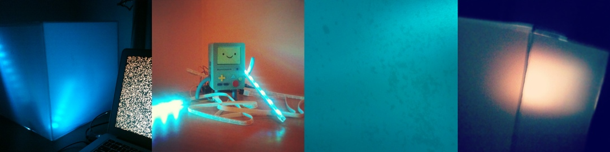
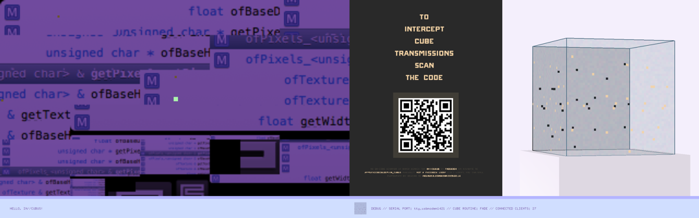
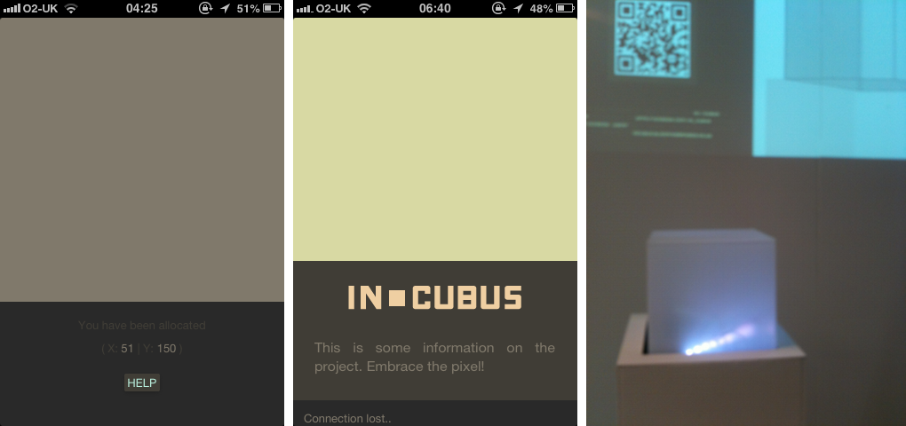

My [Digital Art & Technology Degree Show 2013](http://2013.digitalartandtechnology.co.uk/) piece and biggest project to date was intended to be as mysterious as a [J. J. Abrams feature](http://www.ted.com/talks/j_j_abrams_mystery_box.html), as carefully crafted as an [Andy Zimmermann sculpture](http://andyzimmermann.com), as captivating as a [local multiplayer co-op game](http://zelda.com/fourswordsanniversary/) and as challenging in terms of architecture and scale as building a [mathematical death maze](http://www.imdb.com/title/tt0123755/).

It didn't end up being all of that, so let me rephrase myself: 
        
> __IN//CUBUS__ was an experiment with the aim to determine how far people would go out of their way to uncover the purpose of what presented itself as an alien object inside a gallery space.

Here's the [promotional video](http://www.youtube.com/embed/7iwos1oSYpQ).

__IN//CUBUS__ consists of three parts, the object, the projection and the individual / group experience. True to its original inception, the primary way of interacting with the installation is through an internet-enabled handheld device. 

Next to the ominously glowing cube, a projector shows faces on a rotating cube being occupied, whilst encouraging visitors to join the _scavenger hunt_ by opening up a _Facebook_ application on their devices. 

Debugging sessions

What you get on your screen is a flickering square and two-dimensional coordinates. Now what? The observant new media art gallery visitor will deduct that the coordinates can be traced back on the projection and that, if more people would join in, the cube's faces would eventually be made up of pixels.

What it is, is the sculpture is transmitting a 50x50px small video stream, meaning one would need about _2500_ devices and place them in a grid next to each other (coordinates!) in order to see the full video message. What's more, is that whenever someone new joins, he unknowingly contributes to the content of the video as it is being dynamically generated in the background.

On its brightest day (the opening night) I had maybe about 13 users simultaneously. Still, it is always fun to explore new technologies: I..

- ..made something with _Arduino_ and an _IKEA_ lamp and didn't electrocute myself!
- ..was carelessly streaming binary data over _WebSockets_ 
- ..wrote a networked visualisation in C++ (_openFrameworks_) and
- ..pulled my hair out over _MongoDB_ (for storing all the pixel values). 

The code is up online for your perusal on [GitHub](https://github.com/bloomingbridges/IN_CUBUS). If you're eager, you might even figure out what __IN//CUBUS__'s secret message was all about ;)

Robert demonstrating yet another way to interact with __IN//CUBUS__.
