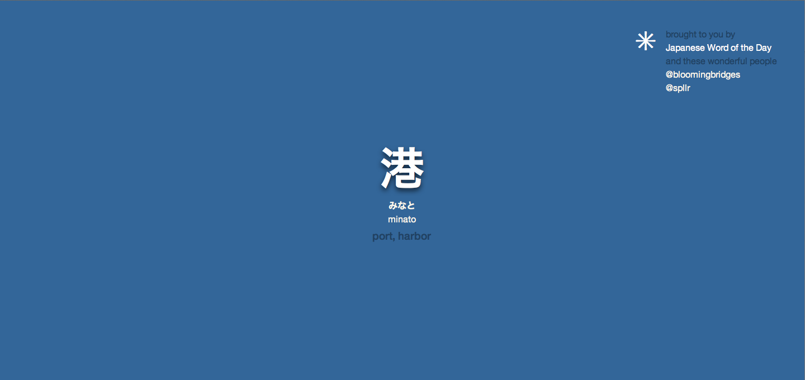

Around the time when the first _CSS3_ goodies such as _text-shadow_ and _transition_ popped up, I got really fed up with the sluggishness of my browser homepage.

So I put my curiosity to good work and produced a little local web app / browser extension that would show me a Japanese word on a solid colour background. If that sounds really basic to you, it's probably because it was. By hovering over it, additional information like pronunciation, _hiragana_ spelling and translation would be revealed, along with the possibility to change the theme in real-time (CSS transitions + localStorage).

Now here come the bad news.. for one, the [site I was using](http://www.japanesewordoftheday.com) to scrape my daily symbols off stopped updating their _RSS_ feed regularly. Further, due to a disagreement with my last hosting provider I no longer have access to the original files that I know of as the browser extension was never completed.

This screenshot of the theme I made in the style of [James King's old website](http://skymist.co.uk) is the single remaining proof of existence. 

Let me assure you it was beautiful while it lasted

