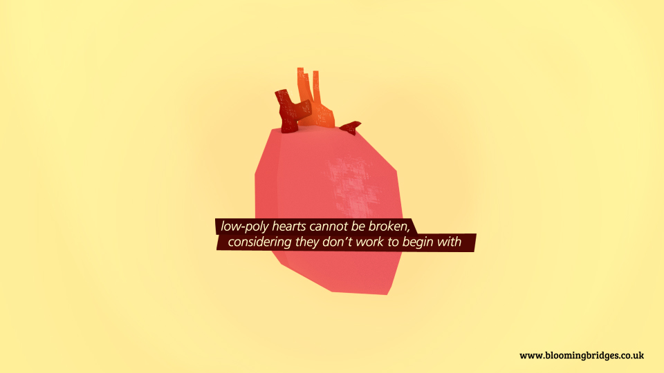

An artwork inspired by the work of Plymouth-based Illustrator [Helena Coard](http://www.helena-coard.co.uk/) and the result of trying to apply a papercraft/handmade feel to low-polygonal geometry, all whilst attempting to master the latest _blender_ interface (before eventually switching back to Maya).