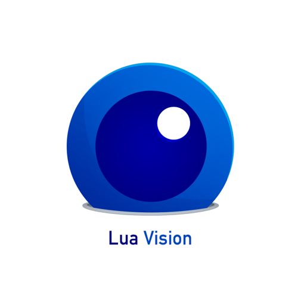

I was given the honour of witnessing the late development, as well as the release of the blazingly-fast open-source NUI (_Natural User Interface_) library [Lua Vision](http://luavision.github.io/lua-vision/), developed by the ever-smoking, ever-rambling computer vision evangelist [Yannis Gravezas](http://wizgrav.com).

Having dabbled in trying to retrieve useful information from the _Microsoft Kinect_ camera before (using _Processing_ + _OpenCV_), I was easily enlightened as to how much faster and flexible _Vision_ was. This comes down to the core _Void_ module, which as I understand, allows you to share resources across several threads / _Lua_ scripts and the fact that for the biggest part the library was written in [LuaJIT](http://luajit.org), a just-in-time compiler that allows you to directly call _C_ functions (libfreenect, libusb being dependencies written in C) from within _Lua_.

Since _Lua_ has outreached its status as the underdog of the academic world and has become more and more ubiquitous over the years, glueing _Lua Vision_ together with any other piece of software can be achieved with only a few lines of code. To show off the technology, we organised a launch event at [Stone Soup](http://stonesoup.io) where we could show some demo applications.

As I wasn't quite on the same technical level as the two main contributors, I decided to go and write a _Dance Dance Revolution_ clone for a demo, using _Lua Vision_ and [LÖVE2D](http://love2d.org). You can read all about it [here](http://luavision.github.io/lua-vision/example/2013/12/14/example-ddr.html).

And of course there was a need for an identity, guess who volunteered to do that part :>

I would love for _Vision_ to have a little graphical user interface, allowing you to choose from several image analysis scripts and pipe that to other applications, as it's currently very much terminal-based and not really accessible to non-coders. I was also thinking of writing a _Kinect_ input plugin for _Unity_, but my license will most likely run out before I'm finished with that.