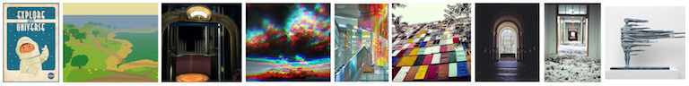
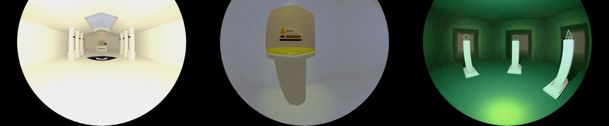

A research project exploring the viability of videogames which can be played in your sleep. Lucid is experienced in a full-dome environment using custom gear for head-tracking and player input using phone accelerometer sensors and a fair amount of Velcro&reg;.

[Project blog](http://sambillingham.github.io/lucid/)

[Design Document (PDF, 1,9MB)][1] - [Director's Cut (PDF, 4,2MB)][2]

[1]: Lucid_Design_Doc_Min.pdf
[2]: Lucid_Design_Doc_Full.pdf