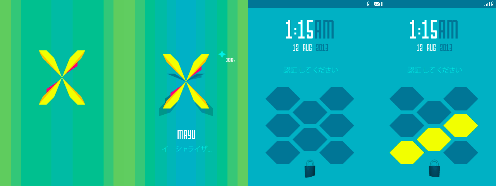

I started __Mayu__ (Japanese for _cocoon_) as an excuse to get more comfortable with _Adobe AfterEffects_, more specificially, learn how and to what extent vector graphics imported from other applications can be animated.

The idea was for a mockup _Android_ ROM, specifically designed with near-future Japanese users in mind, which could be used - for instance - in games or film, without running into licensing problems.

The colour palette is loosely based around the current _Google Nexus_ packaging, in order to have some grounding with an established brand. Apart from that the interface was envisioned to be more stream-lined, bold, colourful and having facebook-app-esque messaging accessible from everywhere in the UI.

I haven't actually made it past the lock screen before I threw in the towel. Animating stuff by hand - as opposed to in code - is tedious. The short but complete render can be found [here](https://www.dropbox.com/s/k18niez6k48lfei/Maju.mov).
