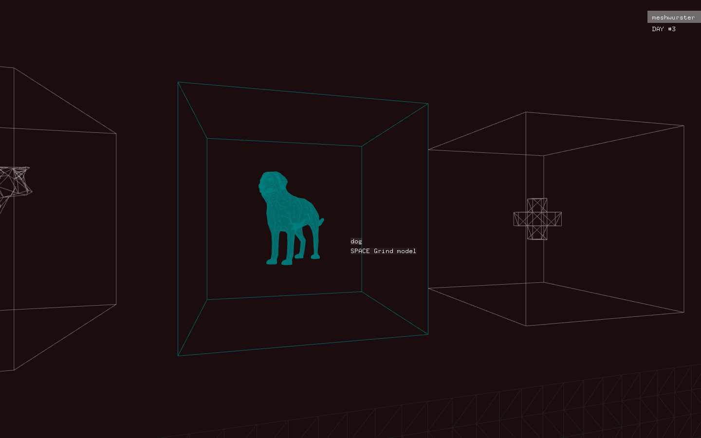
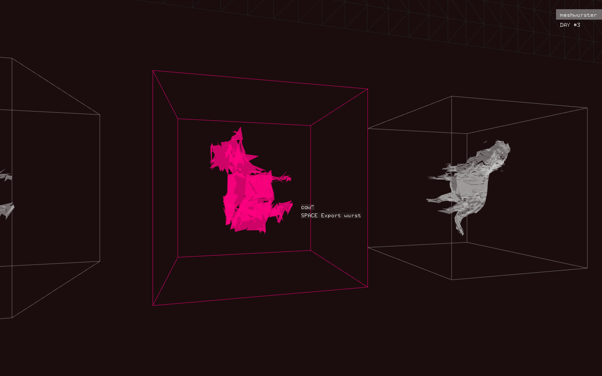

The recent [Google DevArt competition](http://devart.withgoogle.com) gave me an excuse to revisit a three year old project idea of mine: a simplistic little tool called __Meshwurst__. I wanted to explore what happens to 3D geometry when sent through a virtual meat grinder. 

Speaking of excuses, __Meshwurst__ was being developed using my old friend [openFrameworks](http://openframeworks.cc). Not without problems, as apparently there appear to be some issues with _OS X Mavericks_ in the latest release.

And that's about all there is to it. Ideally, the results would not only look pretty, but also be ready for 3D printing so that we could enjoy virtual garbage in physical form. I will continue to work on it, disregarding of the results of the competition as I want to dive deeper into low level computer graphics.

See the [competition entry page](https://devart.withgoogle.com/#/project/18080635) and the [GitHub repo](https://github.com/bloomingbridges/devart-template) for more information.