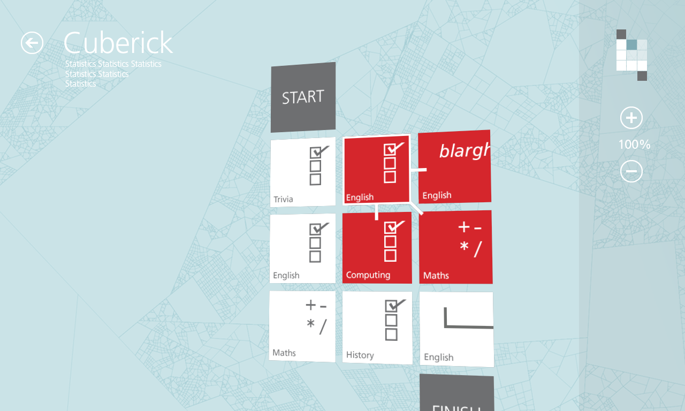
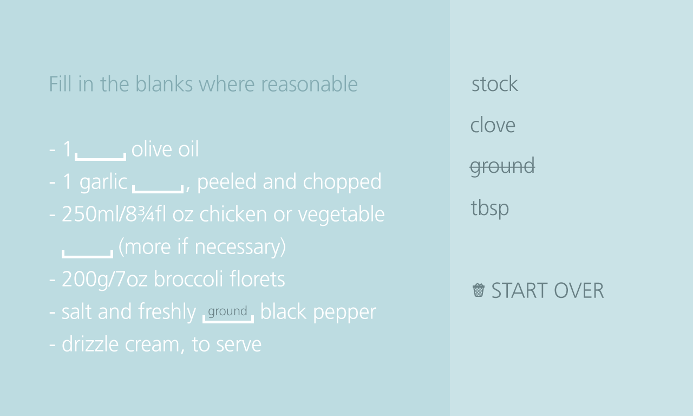
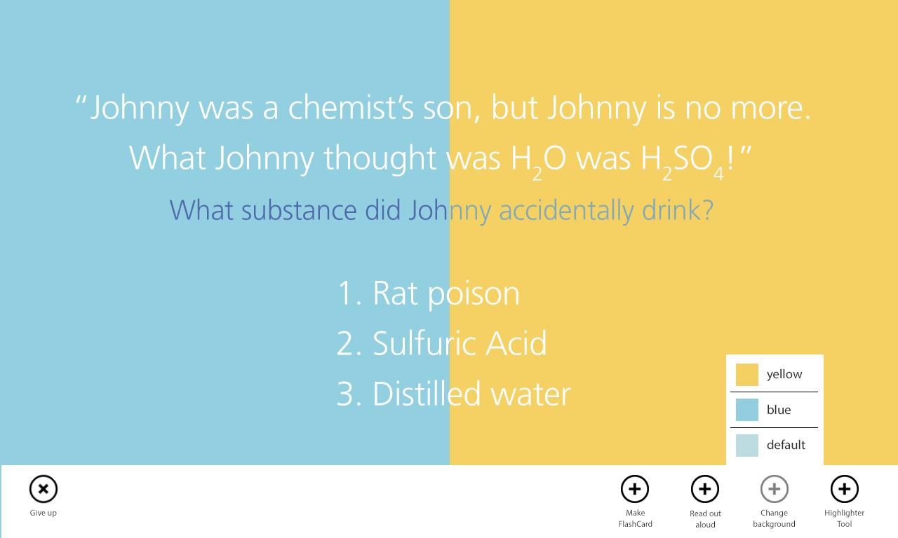
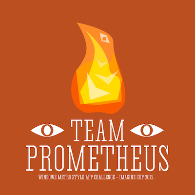

The __Microsoft Imagine Cup 2012__ - as well as all the the _Imagine Cups_ prior and in the future I presume - is a student competition for developing software using _Microsoft_ technology, that would contribute in some way or another to curing the world from its malaises such as hunger or diseases.

We aimed a little lower and went for an app for language / general knowledge acquisition with focus on a mentally _disadvantaged_ userbase. I cannot recall the full motivation this, but I think one of our team members had relatives working in that area.

The format was modelled after vocabulary cards: Each tile in a stage represents a challenge. You would increase your set of available challenges  per category by advancing through the stages (beat one challenge, move up to an adjacent tile, repeat). Each stage can usually be traversed in multiple ways so if you feel like going for that extra practice, nothing is stopping you from doing so, as long as you get to the exit afterwards.

As you can probably imagine, this exercise would have required a crazy amount of content to demo, yet that shouldn't have been the reason why we didn't make it through the second round (the programmers were too busy working on other assignments). Reading up and designing for _Microsoft_'s new incarnation of its desktop behemoth was actually quite enjoyable on my part. I'd do it again, however only with access to a PC.. 

The app bar would host a variety of learning tools and aids, e.g. changing the background colour for better legibility.

Our team logo
