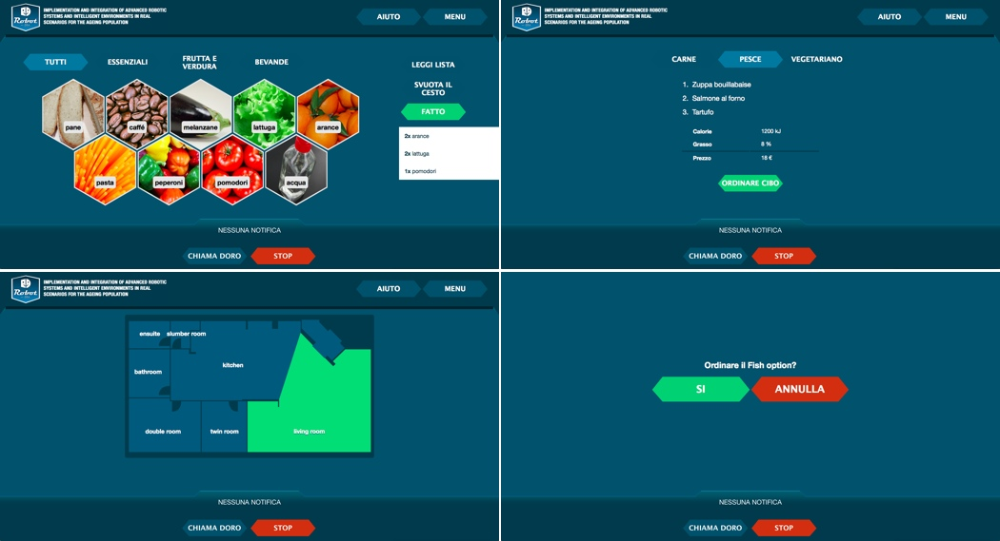
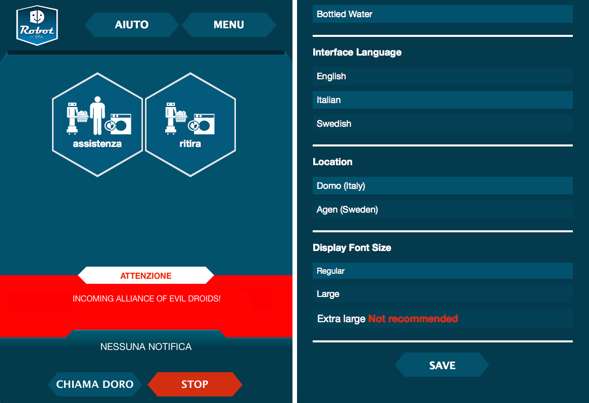

__RobotERA__ is a project commissioned by the _European Union_ and executed by a highly distinct group of Italian individuals at _Plymouth University_, aiming to replace carehome workers with - you probably guessed it already - friendly-looking robot servants.

Each inhabitant will be given a tablet, from which they can send their robot off to fetch groceries, accompany them to another part of the flat or set a friendly reminder to take their medication among others. I was taken onboard to design and implement the interface for the above mentioned, a task more challenging that I could have ever imagined.

All sorts of requirements need to be met when dealing with elderly people: From ridiculous font sizes, screen-obfuscating buttons over the ban of motion and scrolling. See the paradox? To design for a user who probably never even used a computer before, is partially blind and oblivious towards conventions and all the things we take for granted in the modern mobile computing world has been an interesting learning exercise.

Led by Dr Angelo Cangelosi, to whom I owe staying afloat financially during my studies (past projects include [RobotDoc](http://robotdoc.org), [ICDL-IEEE EPIROB Conference 2011](http://www.tech.plym.ac.uk/SoCCE/CRNS/icdl-epirob/2011/), [S-Cube](http://www.s-cubeproject.eu/partners.html) and [Babel](../angelo/babel_concept.png)), the __RobotERA__ project has already seen its first test run in an institution in Italy, with another one in Sweden to follow shortly.

There are still some parts that need polish / refactoring before the next feedback loop and I'm aiming to have the polygonal list _jQuery_ plugin completed and open-sourced by the end of March 2014.