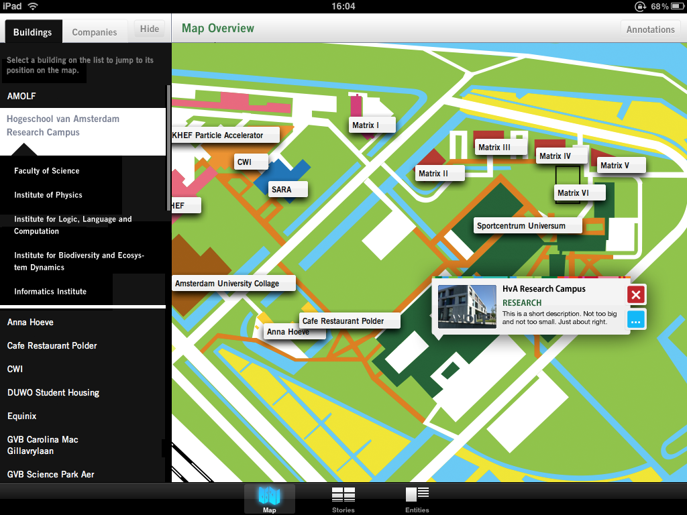
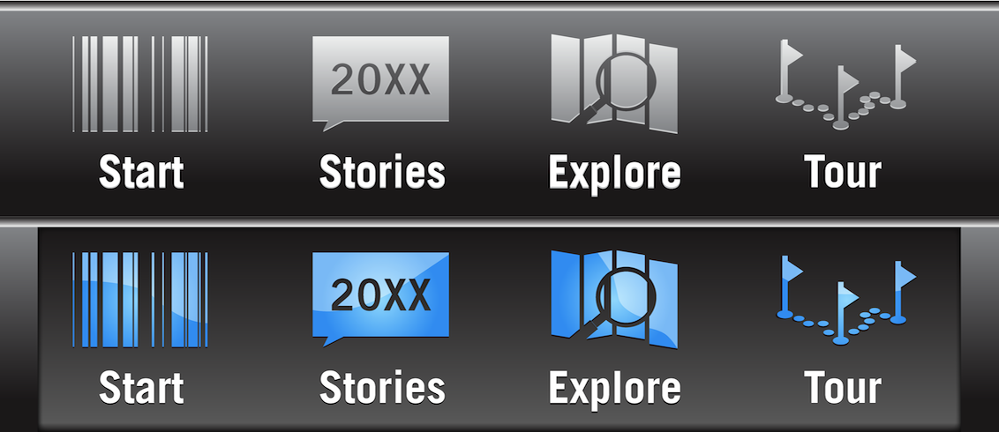

_Appsterdam HQ_ was a great place for hanging out inbetween my placement year and final year at university, not only for meeting interesting people, but for networking and work opportunities. 

So it happened one day, that I was asked to design an _iPad_ (packaged web) app, for and comissioned by the [Science Park Amsterdam](http://www.amsterdamsciencepark.nl), a conglomerate of institutions and research labs located in East Amsterdam.

The main entry point, giving easy access to all the companies in the park with their individual info and media library.

Custom Tab Bar Icons - Way ahead of their time

From what I gathered recently - unfortunately - the app never made it past the pitch stage. Somehow it got accepted, then went lost under a pile of bureaucracy.
