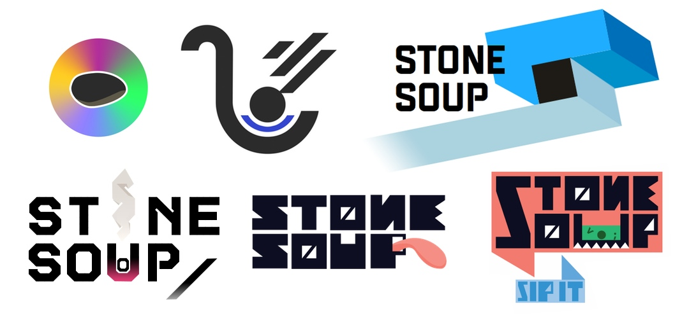

Whilst the old folk tale of the [stone soup](http://en.wikipedia.org/wiki/Stone_Soup) is already fascinating by itself, the story I want to tell is a modern adaption, about a Dutchman named _Klaas Speller_ and the soup he is currently simmering in downtown Athens. Greece.

Klaas and Olga, Appstedam GR, _boiled_ coffee, chaos, shootings, sunshine, food

Hospitality, Vim Crouwel

Rejected designs

<!--  -->

talks, workshops, recommendation
[Website](http://stonesoup.io)