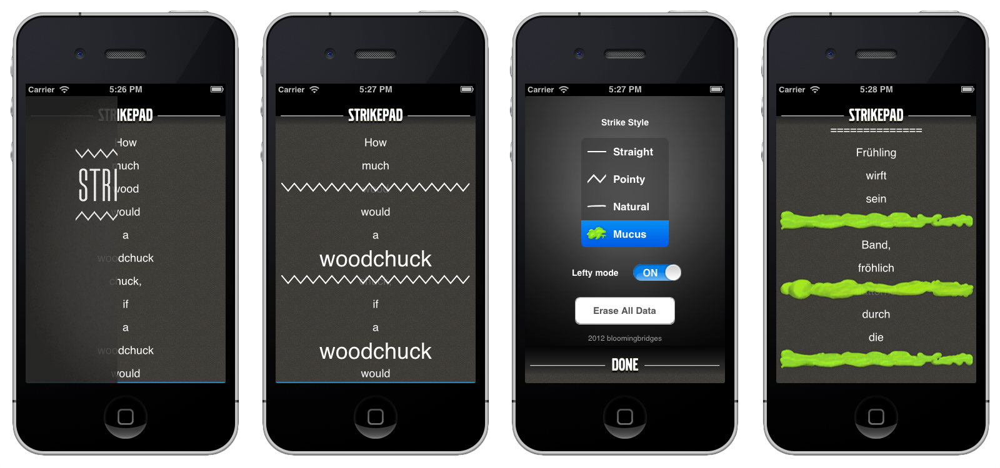

I was sitting together with my designer friend [Chris](http://cristopherdowner.com) in the departure lounge of [Schiphol airport]() back in April 2011, when I had an idea for an app: 

> A note taking application based around the idea that you could strike through items by swiping over them. Each strike would be generated from the (approximate) movement of your fingertip, leaving a natural-looking stroke just as if you'd do a checklist on paper. Reverse the gesture to get rid of the strike.

__StrikePad__ was born. I reckoned it was the perfect project to accompany my first venture into Objective-C and iOS development. 
So after landing the placement and talking it through with my supervisor Mario (who stubbornly insisted that I should use _Unity_ instead) I was allowed to allocate some office hours to read up on the HIG (Human Interface Guidelines) and work on my little pet project.

The app's basic principle got a little more refined during development:

> __Strikepad__ would not allow you to delete items from a pad. Instead the (unique) strikes, in combination with the vertically expanding content would build up your spatial memory, making you remember the position of items in relation to each other. 

> If not, little blue bars on either edge would indicate virgin off-screen items. No unnecessary interface clutter, just gestures (swipe the title to go to / create a new pad for instance, hold down to rename it).

The app in its full glory. The title in the navigation bar could be dragged downwards (with momentum) in order to reveal the preferences panel behind, which made you choose between different strike styles (including mucus).

I was happily working on it for a few months whenever I had a spare moment,  added features to the prototype such as _left-handed mode_, giving weight to elements by pinching it apart and creating elements / editing them through long presses. On my daily grocery routine I regularly pulled out the app on my phone and re-evaluated its usability on the go. Sure it had its technical problems (back in the day, there was no such thing as _automatic reference counting_), but I was making good progress.

Then one day in February, my friend Chris's [outlet](http://realmacsoftware.com) released a _surprisingly similar_ app on the app store with incredible traction. The development of __StrikePad__ came to an abrupt end as a result.

To clarify: My motivation wasn't dampened by the financial success of __Clear__, or the betrayal of a good friend. There was no point in finishing something, which was doomed to only ever be seen as a clone of something bigger. People wouldn't see the app for what it is, the vision, the benefit and it saddens me that I couldn't be the one introducing these radical new ideas to the millions of _iOS 5_ users out there.

R.I.P. 
__StrikePad__ 
2011 - 2012 
\/\/\/\/\/\/\/\/\/\/\/\/\/\/\/\/\/\/\/\/\/

