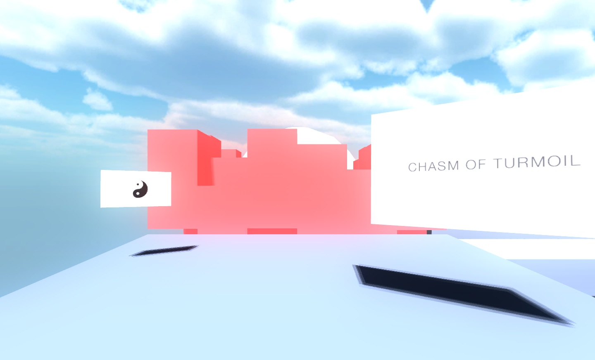
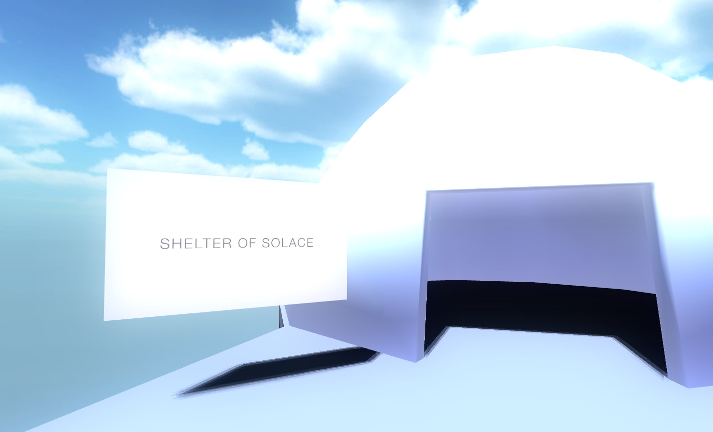
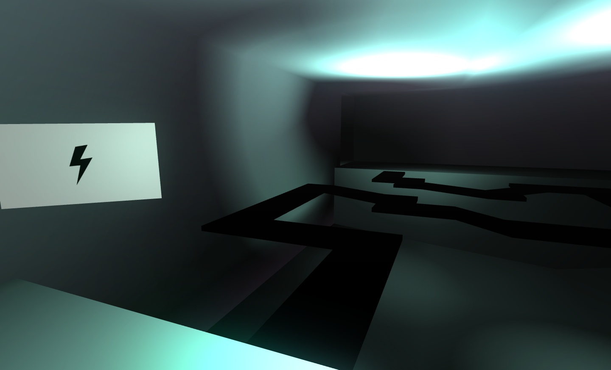

_Zen Trials_ was another product of the experimental _DAT 301 Real-time_ module at university, which asked four of us to come up with a mini project  involving inexpensive biofeedback sensors. I, who recently required a student license for _Unity Pro_, spent the following weekend modelling a little testing environment and learning C#, whereas everybody else investigated the APIs for the mind-reading headset from _Neurosky_.

Eventually we figured, that we could combine the two points of research and make a short game that incorporated the technology. _Zen Trials_ is a gauntlet consisting of three challenges: The first obstacle is a wall of blocks, which could be tamed by relaxing. 

The Chasm of Turmoil

The dome required of the player to close their eyes for a brief moment and the final challenge was a balancing act, made extra difficult by turning off the lights for a few seconds whenever the player blinked.

The Shelter of Solace

Stay alert!

The game ended on a scene with a giant obelisk, which was originally meant to hold some kind of highscore table, but there just wasn't enough time. There had also been an unfinished secret area, that could be reached by actually falling into deep sleep in the _Shelter of Solace_.

It worked rather well in the presentation, the recording of which - unfortunately - got lost in cyberspace. We would later pick up this project and try and evolve it into something [bigger](/portfolio/lucid/index.html).
