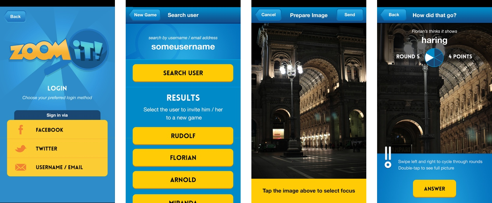

_ZoomIt!_ is a two-player, turn-based game for iPhone and eventually Android devices, in which you send your opponent a zoomed-in photograph of an object, place or person for them to guess.

Rudolf, the inventor as well as developer of the app approached me in 2013 to "leuk up" his original designs and make it ready to be released to the public. From there it got a new logo, a refreshed colour palette, a dozen of new UI elements and a couple of sensible features more.

It got featured in the [iDeveloper podcast](http://ideveloper.co/podcast095/) and is currently backed by a marketing campaign that I don't have my hands in. Check out the fancy [promotional website](http://playzoomit.com) they made!

And of course, get the [app for free](https://itunes.apple.com/app/zoomit!/id612470010) while it's still hot!